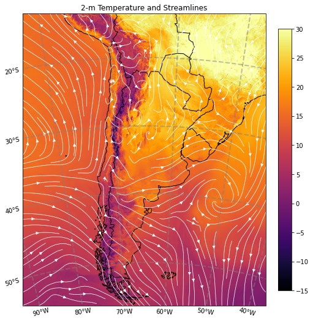

# Ejemplo para graficar un campo de temperatura a 2m y líneas de corriente.
#*Example to plot a 2-m temperatura and streamlines.*


```python
# Importamos las librerías necesarias  (en caso de ser necesario, instalar utilizando el comando pip install)
# We import the necessary libraries    (if needed, install by using the command pip install)
import xarray as xr
import h5netcdf
import datetime
import s3fs
import cartopy.crs as ccrs
import cartopy.feature as cf
import matplotlib.pyplot as plt
import metpy.calc as mpcalc
```

Definimos la fecha y hora de inicialización del pronóstico: <br />
*We define the forecast initialization date:* 


```python
init_year = 2022
init_month = 10
init_day = 27
init_hour = 0
START_DATE = datetime.datetime(init_year, init_month, init_day, init_hour)
```

Definimos el plazo de pronóstico a graficar: <br />
*We define the forecast lead time to plot:*


```python
lead_time = 12
```

Leemos el archivo: <br />
*We read the file:*


```python
filename = 'WRFDETAR_01H_{:%Y%m%d_%H}_{:03d}.nc'.format(START_DATE,lead_time) 
print(filename)
ds = xr.open_dataset(filename, decode_coords = 'all', engine = 'h5netcdf')
```

    WRFDETAR_01H_20221027_00_012.nc


Calculamos las componentes zonal y meridional del viento a 10m: <br />
*We calculate the zonal and meridional components of 10-m wind:*


```python
u, v = mpcalc.wind_components(ds['magViento10'], ds['dirViento10'])

u = u.metpy.dequantify()
v = v.metpy.dequantify()
```

Generamos la figura: <br />
*We generate the plot:*


```python
# Seleccionamos la proyección de los datos
# We chose a map projection

projection = ccrs.LambertConformal(ds.CEN_LON, ds.CEN_LAT, standard_parallels = (ds.TRUELAT1, ds.TRUELAT2), cutoff = -5)

fig, ax = plt.subplots(1, 1, figsize = (7, 10), constrained_layout = True, subplot_kw = {'projection': projection})
ax.set_extent(extents=[-500*4000, 500*4000, -600*4000, 600*4000], crs = projection)
cs = ax.pcolormesh(ds['lon'], ds['lat'], ds['T2'][0, :, :], vmin = -15, vmax = 30, cmap = 'inferno', transform = ccrs.PlateCarree())
strm = ax.streamplot(ds['lon'].values, ds['lat'].values, u[0, :, :].values, v[0, :, :].values, density = [1.5, 1.5], color = 'white', linewidth = 0.75, transform = ccrs.PlateCarree())
ax.add_feature(cf.COASTLINE)
ax.add_feature(cf.BORDERS)
ax.set_title(f'2-m Temperature and Streamlines')
gl = ax.gridlines(crs = ccrs.PlateCarree(), draw_labels = True, x_inline = False,
                  linewidth = 2, color = 'gray', alpha = 0.5, linestyle = '--')
gl.top_labels = False
gl.right_labels = False
plt.colorbar(cs, shrink = 0.6)
plt.show()
```


    
Para descargar la notebook, acceder al siguiente [link](../notebooks/Plot_Region.ipynb). <br />
*To download the notebook, go to the following [link](../notebooks/Plot_Region.ipynb).*

