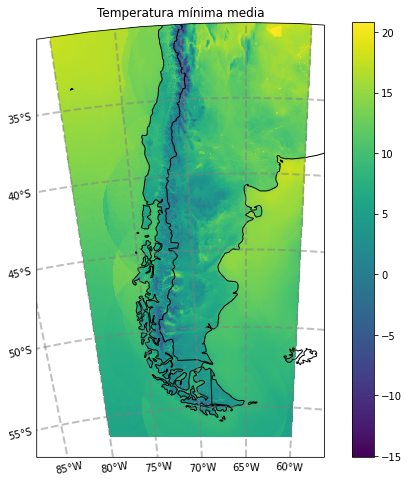

# Gráfico de una región

Ejemplo para el cálculo de la humedad relativa media en una región.

```python
# Se importan las librerías necesarias
import xarray as xr
import h5netcdf
import datetime
import s3fs
import cartopy.crs as ccrs
import cartopy.feature as cf
import matplotlib.pyplot as plt
import regionmask
```

Se define la fecha y hora de inicialización del pronóstico:

```python
año_fcst = 2022
mes_fcst = 3
dia_fcst = 21
hora_fcst = 0
```

Se define el período en el que se va a promediar la humedad relativa:

```python
año_ini = 2022
mes_ini = 3
dia_ini = 21
hora_ini = 0

año_fin = 2022
mes_fin = 3
dia_fin = 21
hora_fin = 23
```

Se define la región a graficar:

```python
lat_min = -60
lat_max = -30
lon_min = -80
lon_max = -60
```

Se leen los pronósticos:

```python
FECHA_FCST = datetime.datetime(año_fcst, mes_fcst, dia_fcst, hora_fcst)

FECHA_INI = datetime.datetime(año_ini, mes_ini, dia_ini, hora_ini)
FECHA_FIN = datetime.datetime(año_fin, mes_fin, dia_fin, hora_fin)

# Se calcula el plazo de pronóstico
plazo_ini = int((FECHA_INI - FECHA_FCST).total_seconds()/3600)
plazo_fin = int((FECHA_FIN - FECHA_FCST).total_seconds()/3600)

fs = s3fs.S3FileSystem(anon=True)

files = [f'smn-ar-wrf/DATA/WRF/DET/{FECHA_FCST:%Y/%m/%d/%H}/WRFDETAR_01H_{FECHA_FCST:%Y%m%d_%H}_{plazo:03d}.nc' for plazo in range(plazo_ini, plazo_fin)]

ds_list = []
for s3_file in files:
    print(s3_file)
    if fs.exists(s3_file):
        f = fs.open(s3_file)
        ds_tmp = xr.open_dataset(f, decode_coords = 'all', engine = 'h5netcdf')
        ds_list.append(ds_tmp)
    else:
        print('el archivo {} no existe'.format(s3_file))

ds = xr.combine_by_coords(ds_list, combine_attrs = 'drop_conflicts')
```

Se seleccionan los datos pertenecientes a la región y se calcula la humedad relativa media diaria:

```python
esquinas = [[lon_min, lat_min], [lon_min, lat_max], [lon_max, lat_max], [lon_max, lat_min]]

# Se arma la máscara de la región
region = regionmask.Regions([esquinas])
mascara = region.mask(ds['lon'], ds['lat'])

# Se selecciona la variable HR2 y se calcula el valor medio diario
HR = ds[['HR2']]
HR_media = HR.mean(dim = 'time')

# Se aplica la máscara eliminando los valores por fuera de ésta
HR_region = HR_media.where(mascara == 0, drop = True)
```

```python
# Se selecciona la proyección de los datos
proyeccion = ccrs.LambertConformal(central_longitude = ds.CEN_LON, 
                                   central_latitude = ds.CEN_LAT, 
                                   standard_parallels = (ds.TRUELAT1, 
                                                         ds.TRUELAT2))

fig = plt.figure(figsize = (10, 8)), 
ax = plt.axes(projection = proyeccion)
cbar = ax.pcolormesh(HR_region['lon'], HR_region['lat'], HR_region['HR2'], transform = ccrs.PlateCarree(), vmin = 0, vmax = 100)
ax.add_feature(cf.COASTLINE) #Agrega las costas
ax.add_feature(cf.BORDERS) #Agrega los limites de los paises
ax.set_title(f'Humedad relativa media')

gl = ax.gridlines(crs = ccrs.PlateCarree(), draw_labels = True, x_inline = False,
                  linewidth = 2, color = 'gray', alpha = 0.5, linestyle = '--')
gl.top_labels = False
gl.right_labels = False
plt.colorbar(cbar)
```



Para descargar la notebook, acceder al siguiente <a href="../notebooks/Region.ipynb">link</a>.
    
