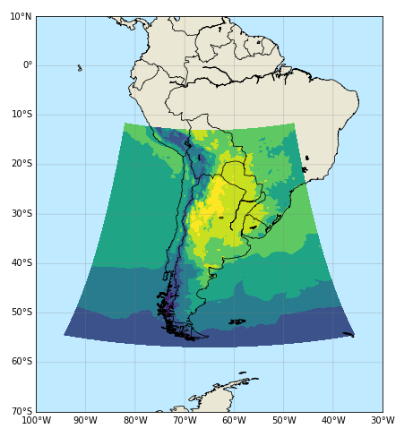

.. Prueba documentacion documentation master file, created by
   sphinx-quickstart on Wed Mar 16 18:44:28 2022.
   You can adapt this file completely to your liking, but it should at least
   contain the root `toctree` directive.

Documentación del modelo WRF en Amazon Web Services
===================================================

El Servicio Meteorológico Nacional de Argentina (`SMN-Arg <https://www.smn.gob.ar/>`_) corre en forma operativa el modelo regional de alta resolución Weather Research and Forecasting Model (WRF) en su versión con núcleo dinámico Advanced Research WRF (ARW) version 4.0 (`Skamarock et al., 2008 <http://dx.doi.org/10.5065/D68S4MVH>`_). El modelo resuelve la convección en forma explícita con paso de tiempo variable y fue configurado utilizando las siguientes parametrizaciones:

- Microfísica: WSM6 (un momento - 6 clases) 
- Radiación onda larga: RRTM
- Radiación onda corta: Dudhia
- Capa Límite Planetaria: MYJ (Mellor, Yamada, Janjic)
- Modelo de suelo: NOAH, 4 capas (0-10 cm, 10-40 cm, 40-100 cm, 1-2 m)

Los pronósticos horarios generados con el modelo WRF-Arg cuentan con una resolución horizontal de 4 km con 45 niveles verticales (tope 10 hPa) y plazo máximo de 72 horas. Los mismos se inicializan con los análisis y pronósticos horarios del NCEP-NOAA Global Forecasting System Model (GFS) de 0.25° de resolución horizontal.

La proyección de los datos es Conforme de Lambert y el dominio abarca todo Argentina como se puede apreciar en la Figura 1: 

*Figura 1: Dominio WRF-Arg*

Más detalles de la configuración se pueden encontrar en el siguiente `link <http://repositorio.smn.gob.ar/handle/20.500.12160/1402>`_.

.. toctree::
    :maxdepth: 2
    :caption: Contenido:

    Informacion_general
    Estructura_de_datos
    Formato_de_datos
    Acceso_a_los_datos
    Tutoriales
    Novedades
